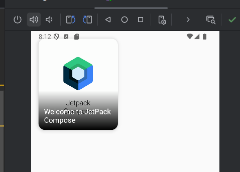

Here’s a complete `ImageCard.md` file you can include in your Jetpack Compose UI learning repo. It explains the purpose of the code, shows usage, and includes a placeholder for an output image.

---

### 📄 `ImageCard.md`

````md
# 🖼️ ImageCard Composable – Custom Card with Image and Gradient Overlay

This example demonstrates how to create a custom `ImageCard` in Jetpack Compose, with:
- A background image
- A gradient overlay to enhance readability
- Title text aligned to the bottom-left

---

## 🛠️ Code Snippet

```kotlin
class MainActivity : ComponentActivity() {
    override fun onCreate(savedInstanceState: Bundle?) {
        super.onCreate(savedInstanceState)
        enableEdgeToEdge()
        setContent {
            val painter = painterResource(id = R.drawable.example1)
            val description = "Welcome to JetPack Compose"
            val title = "Welcome to JetPack Compose"
            Box(
                modifier = Modifier
                    .fillMaxWidth(0.5f)
                    .padding(16.dp)
            ) {
                ImageCard(
                    painter = painter,
                    contentDescription = description,
                    title = title
                )
            }
        }
    }
}

@Composable
fun ImageCard(
    painter: Painter,
    contentDescription: String,
    title: String,
    modifier: Modifier = Modifier
) {
    Card(
        modifier = modifier.fillMaxWidth(),
        shape = RoundedCornerShape(15.dp),
        elevation = CardDefaults.cardElevation(
            defaultElevation = 5.dp
        )
    ) {
        Box(modifier = Modifier.height(200.dp)) {
            Image(
                painter = painter,
                contentDescription = contentDescription,
                contentScale = ContentScale.Crop
            )

            Box(
                modifier = Modifier
                    .fillMaxSize()
                    .background(
                        brush = Brush.verticalGradient(
                            colors = listOf(
                                Color.Transparent,
                                Color.Black
                            ),
                            startY = 300f
                        )
                    )
            )

            Box(
                modifier = Modifier
                    .fillMaxSize()
                    .padding(12.dp),
                contentAlignment = Alignment.BottomStart
            ) {
                Text(
                    title,
                    style = TextStyle(
                        color = Color.White,
                        fontSize = 16.sp
                    )
                )
            }
        }
    }
}
````

---

## 📌 Key Concepts Used

* **`Image` with `ContentScale.Crop`** to fill the space while maintaining image proportions.
* **`Box` with gradient** to improve text visibility on top of an image.
* **`Card`** with elevation and rounded corners for Material Design look.

---

## 📷 Output Preview

> Replace the image below with a real screenshot of your output after running the code in Android Studio.



---

## 💡 Tip

To take a screenshot:

1. Run the app on an emulator or device.
2. Capture the screen using Android Studio or the device.
3. Save the image to `/assets/image_card_output.png` and push it to your repo.

---

✅ This example is great practice for combining layout, image manipulation, and design layering in Jetpack Compose.

```

---

Would you like me to generate the actual UI output image from this code using a mock image, or are you planning to add your real screenshot manually?
```
